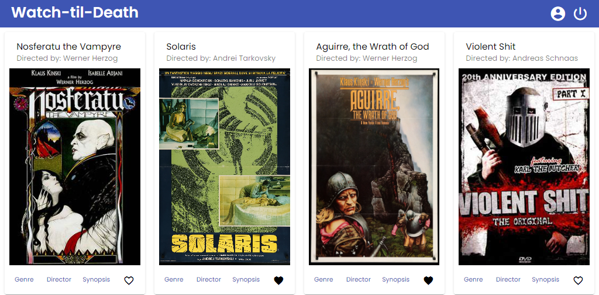

# MovieAppAngularClient

This repository contains the client side for my web application Watch-Til-Death, built with Angular and Angular Material. The web application provides users with access to information about different movies, directors, and genres. Users are able to sign up, update their personal information, and create a list of their favorite movies. The app implements JWT token-based user authentication. 

 

## Table of contents

- [Links](#links)
- [Setup instructions](#setup-instructions)
- [What I learned](#what-i-learned)

## Links

- Deployed app: [https://lxnhard.github.io/movie_app-angular-client]
- Rest API: [https://github.com/lxnhard/movie_api]

## Setup instructions

This project was generated with [Angular CLI](https://github.com/angular/angular-cli) version 15.1.2.

### Development server

Run `ng serve` for a dev server. Navigate to `http://localhost:4200/`. The application will automatically reload if you change any of the source files.

### Build

Run `ng build` to build the project. The build artifacts will be stored in the `dist/` directory.

## What I learned

- Building an app with Angular, including
 - consuming REST API with HttpClient
 - Injectables
 - design with Angular Material
- Technical documentation with TypeDoc 